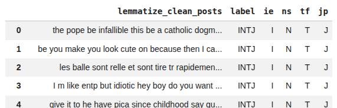
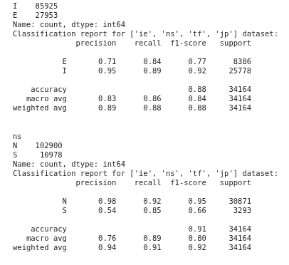
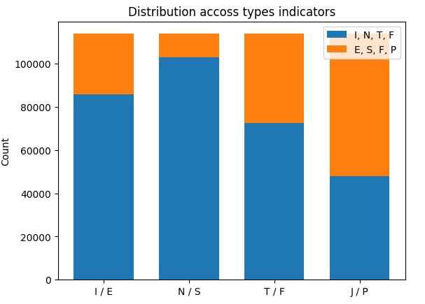
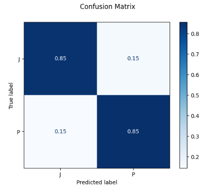
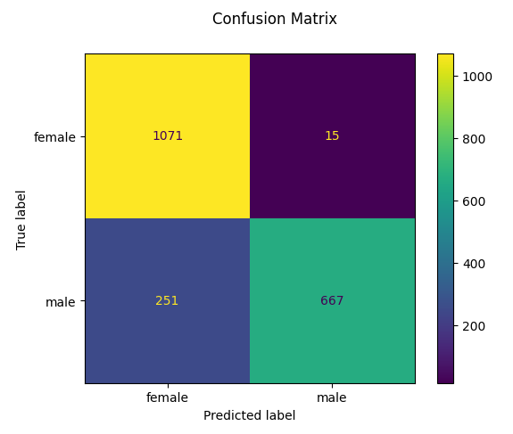

# SP26 Jhonathan Parada
TASK: Research Hugging Face Spaces for UI and model deployment (simplest way).

ML research with Jhonathan Parada  
Currently working on: Hosting of the service.  

**Tunning**  
- [This article](https://alaskalam.medium.com/predicting-introversion-extroversion-based-on-your-writing-43c08512f236) removes "stopwords" like (the, for, in, a), my dataset does not. What difference does that make?  

When displaying the confusion matrix of the models, I enabled the normalization parameter because the dataset is unbalanced.
"if 'true', the confusion matrix is normalized over the true conditions (e.g. rows);" [source](https://scikit-learn.org/stable/modules/generated/sklearn.metrics.ConfusionMatrixDisplay.html)  
**Roadmap**  
Datasets that will be used(3):
- [MBTI Personality Types 500 Dataset](https://www.kaggle.com/datasets/zeyadkhalid/mbti-personality-types-500-dataset)  (Includes cleaned [(MBTI) Myers-Briggs Personality Type Dataset](https://www.kaggle.com/datasets/datasnaek/mbti-type) and [Myers Briggs Personality Tags on Reddit Data](https://zenodo.org/records/1323873#.YXhg5xpBzIV))  
**Notes:** Total 106K records  
- [MBTI Personality Type Twitter Dataset](https://www.kaggle.com/datasets/mazlumi/mbti-personality-type-twitter-dataset)(Manually cleaned+lemmatized to combine with [MBTI Personality Types 500 Dataset](https://www.kaggle.com/datasets/zeyadkhalid/mbti-personality-types-500-dataset))  

  

**Notes:** Because Lemmatization took 10 minutes to be applied to around 8K entries with text, it was exported and uploaded to Kaggle to not having to when training the model.  
Time to lemmatize: 10 Minutes.  
Cleaned Dataset Link: [Cleaned MBTI Personality Type Twitter Dataset](https://www.kaggle.com/datasets/jhonatanparada/cleaned-mbti-personality-type-twitter-dataset)  
|  
Notebooks for inspiration:  
- [Predicting Introversion/Extroversion Based on Your Writing?](https://alaskalam.medium.com/predicting-introversion-extroversion-based-on-your-writing-43c08512f236)  
- [MBTI - 16 Personalities classifier](https://github.com/edu-rinaldi/MBTI-Predictor/blob/main/MBTI.ipynb)  
- [AdvancedMBTI TextClassification](https://www.kaggle.com/code/hadia150/advancedmbti-textclassification)  
- [Python | PoS Tagging and Lemmatization using spaCy](https://www.geeksforgeeks.org/machine-learning/python-pos-tagging-and-lemmatization-using-spacy/)  

Below is the performance of Introvert vs Extrovert and Sensing(S) vs Intuition(N) against a random 30% of the combined dataset of 112K~ values. Test Data was about 34K entries.  
  

**Distribution across Types Indicators**  
Code Implementation: https://www.kaggle.com/code/rajshreev/mbti-personality-predictor-using-machine-learning  
  

**Normalized Confusion Matrices**  
The normalized confusion matrix of the most balanced distribution across types indicators (J) and (P) is shown below:  


**Binary Models Hosted on Hugging Face:** https://huggingface.co/jhonatanparada499/binary-mbti-classifiers/tree/main

## Personality

### Datasets
- [MBTI Personality Types 500 Dataset](https://www.kaggle.com/datasets/zeyadkhalid/mbti-personality-types-500-dataset)  
- [Cleaned MBTI Personality Type Twitter Dataset](https://www.kaggle.com/datasets/jhonatanparada/cleaned-mbti-personality-type-twitter-dataset)  

- [OCEAN Personality Types](https://huggingface.co/datasets/Fatima0923/Automated-Personality-Prediction)  

### Papers
- [Personality Detection using XLM-ROBERTa and
Whisper](papers/Personality_Detection_Using_Xlm-Roberta_and_Whisper.pdf)  

**Notes:** Paper seems to be a pipeline design to process either text or audio data(bimodal) using Whisper(ASR, whisper-large-v3), a tokenizer, and a "tuned" classification model called XLMRobertaClassifier to predict MBTI types. They used MBTI types as labels and forum posts(video links and text concatenated by |||) from profiles as features. (03-28).  

How does hybrid resampling work? Specially how did they convert less than 250 samples into 800 samples in Fig. 3 and 4?  
What do you mean by "implemented via the Hugging Face 'pipeline'" and "Hugging Face 'Trainer' API"? (03-02)

### MBTI Examples
- [Personality Prediction Project using ML](https://www.geeksforgeeks.org/machine-learning/overview-of-personality-prediction-project-using-ml/)
- [predicting personality from social media text.](https://rismakov.com/mbti-prediction/category/Scikit-learn)

### Toy Examples
#### Natural Language Processing  
- Classifying User Gender Based on Tweet Text  

[tfidf_classifying_user_gender_based_on_tweet_text.ipynb](./toy_examples/lang_processing/tfidf_classifying_user_gender_based_on_tweet_text.ipynb) is trained using [Twitter User Gender Classification](https://www.kaggle.com/datasets/crowdflower/twitter-user-gender-classification)  
 
As of 03-16-2026, the gender prediction model has a 87% accuracy, 18% more than the previous week.
  

**Roadmap**  
[Working With Text Data](https://scikit-learn.org/1.4/tutorial/text_analytics/working_with_text_data.html) (Done).  
keywords: Bags of words, n-grams CountVectorizer, naïve Bayes classifier(scikit implementation: MultinomialNB), automatic param tunning  
|  
[NLP: Text Vectorization Methods with SciKit Learn](https://admantium.medium.com/nlp-text-vectorization-methods-with-scikit-learn-4ada4e845a73)  (Done)  
keywords: CountVectorizer, Corpus, Preprocessor, one-hot encoder, tfldf vectorizer  
|  
[classifying-user-gender-based-on-tweet-text.ipynb](toy_examples/lang_processing/classifying-user-gender-based-on-tweet-text.ipynb) (Done)  

Code Modifications and Observations:
- Added extra backspace characters to fix regex expression in text normalization
- Added metrics visualization and discovered 2 more categories from the dataset: brand & unknown
- Passed the 'all_features' column to the fit_transform method, which the author seemed to have forgotten, increasing accuracy by 10%
- Added debug tasks to fix gender_nonones & extra categories
- Noticed that the score method changes the value each time is run, I do not understand why.
- Removed non-male and non-female labels from dataset
- improved model by implementing a tlfid transformer into a pipeline

**Friday Notes**: TfidfTransformer is not a tokenizer, but a transformer because it takes a tokenizer object(like a CountVectorizer) and transform the words(tokens) by frecuency, hence the term "Term Frecuency", and it "downscale the weights for words that occur in many documents,
hence "Term Frecuency times Inverse Document Frequency"  
```
CountVectorizer
Transforms text into a sparse matrix of n-gram counts.

TfidfTransformer
Performs the TF-IDF transformation from a provided matrix of counts.
```

There is a TfidfTransformer and TfidfVectorizer, the latter one is a CountVectorizer followed by a TfidfTransformer. The vectorizer versions support options to set the N-gram of the tokens.  
I found this code snippet which seems very to be a clean way to implement a pipeline  
source: [Scikit-learn Working with Text Data](https://scikit-learn.org/1.4/tutorial/text_analytics/working_with_text_data.html)  
```python
>>> from sklearn.linear_model import SGDClassifier
>>> text_clf = Pipeline([
...     ('vect', CountVectorizer()),                        # Vectorizer
...     ('tfidf', TfidfTransformer()),                      # Transformer
...     ('clf', SGDClassifier(loss='hinge', penalty='l2',   # Classifier
...                           alpha=1e-3, random_state=42,
...                           max_iter=5, tol=None)),
... ])

>>> text_clf.fit(twenty_train.data, twenty_train.target)
Pipeline(...)
>>> predicted = text_clf.predict(docs_test)
>>> np.mean(predicted == twenty_test.target)
0.9101...
```

#### Computer Vision
- Recognizing Written Digits Using a [Dataset](https://www.kaggle.com/datasets/olafkrastovski/handwritten-digits-0-9?resource=download) from Kaggle

[recognizing_written_digits.ipynb](toy_examples/comp_vision/recon_written_digits/recognizing_written_digits.ipynb) is trained using half the [kaggle_written_digits](https://www.kaggle.com/datasets/olafkrastovski/handwritten-digits-0-9?resource=download) dataset from Kaggle. Then, it is tested (validated) using its next half. Furthermore, to prove compatibility with other datasets, the [Scikit-learn digits](https://scikit-learn.org/stable/auto_examples/classification/plot_digits_classification.html) dataset from Scikit-learn is passed to the model to make predictions. The performance metrics for both cases are:

Results on [kaggle_written_digits](https://www.kaggle.com/datasets/olafkrastovski/handwritten-digits-0-9?resource=download) test partiton
```
Classification report for classifier SVC(gamma=0.001):
              precision    recall  f1-score   support

           0       0.92      0.92      0.92      1138
           1       0.85      0.94      0.89      1126
           2       0.90      0.89      0.90      1101
           3       0.80      0.83      0.81      1092
           4       0.81      0.83      0.82      1112
           5       0.90      0.82      0.85      1067
           6       0.82      0.91      0.86      1015
           7       0.87      0.89      0.88      1074
           8       0.83      0.74      0.78      1024
           9       0.86      0.77      0.81      1029

    accuracy                           0.86     10778
   macro avg       0.86      0.85      0.85     10778
weighted avg       0.86      0.86      0.85     10778
```

Results on [Scikit-learn digits](https://scikit-learn.org/stable/auto_examples/classification/plot_digits_classification.html) test partition
```
Classification report for classifier SVC(gamma=0.001):
              precision    recall  f1-score   support

           0       0.92      0.98      0.95        88
           1       0.98      0.44      0.61        91
           2       0.92      1.00      0.96        86
           3       0.84      0.84      0.84        91
           4       0.79      0.75      0.77        92
           5       0.94      0.51      0.66        91
           6       0.94      0.90      0.92        91
           7       0.98      0.45      0.62        89
           8       0.61      0.80      0.69        88
           9       0.41      0.91      0.57        92

    accuracy                           0.76       899
   macro avg       0.83      0.76      0.76       899
weighted avg       0.83      0.76      0.76       899
```

- Recognizing Written Alphabet Using a [Dataset](https://www.kaggle.com/datasets/sankalpsrivastava26/capital-alphabets-28x28/data) from Kaggle
[recognizing_written_alphabet.ipynb](toy_examples/comp_vision/recon_written_alphabet/recognizing_written_alphabet.ipynb) is trained using the [Alphabets Dataset (300x300)](https://www.kaggle.com/datasets/sankalpsrivastava26/capital-alphabets-28x28/data) dataset from Kaggle. For each character category, 1600 images are used for training and testing.Then, it is tested (validated) using its next half. Here is its performance:

```
Classification report for Kaggle dataset:
              precision    recall  f1-score   support

           A       0.88      0.90      0.89       808
           B       0.88      0.83      0.85       810
           C       0.93      0.89      0.91       797
           D       0.90      0.85      0.88       774
           E       0.81      0.82      0.81       789
           F       0.91      0.89      0.90       812
           G       0.58      0.87      0.70       794
           H       0.89      0.83      0.86       811
           I       0.76      0.91      0.83       768
           J       0.91      0.89      0.90       817
           K       0.91      0.86      0.88       811
           L       0.96      0.93      0.95       808
           M       0.96      0.93      0.94       813
           N       0.92      0.90      0.91       779
           O       0.91      0.95      0.93       797
           P       0.90      0.92      0.91       820
           Q       0.93      0.84      0.88       797
           R       0.93      0.85      0.89       832
           S       0.96      0.94      0.95       817
           T       0.96      0.93      0.95       841
           U       0.93      0.92      0.92       787
           V       0.92      0.90      0.91       798
           W       0.94      0.92      0.93       780
           X       0.96      0.88      0.92       791
           Y       0.92      0.89      0.90       790
           Z       0.92      0.91      0.92       772

    accuracy                           0.89     20813
   macro avg       0.90      0.89      0.89     20813
weighted avg       0.90      0.89      0.89     20813
```

## Articles Read
- [Easiest way to download kaggle data in Google Colab](https://www.kaggle.com/discussions/general/74235)
- [Recognizing hand-written digits](https://scikit-learn.org/stable/auto_examples/classification/plot_digits_classification.html)
- [Working With Text Data](https://scikit-learn.org/1.4/tutorial/text_analytics/working_with_text_data.html)
- [Personality Detection using XLM-ROBERTa and Whisper](papers/Personality_Detection_Using_Xlm-Roberta_and_Whisper.pdf)  
- [Google ML Concepts](https://developers.google.com/machine-learning/crash-course/)
- [Classifying User Gender Based on Tweet Text](https://www.kaggle.com/code/kinguistics/classifying-user-gender-based-on-tweet-text/notebook)
- [Bag of words (BoW) model in NLP](https://www.geeksforgeeks.org/nlp/bag-of-words-bow-model-in-nlp/)
- [NLP: Text Vectorization Methods with SciKit Learn](https://admantium.medium.com/nlp-text-vectorization-methods-with-scikit-learn-4ada4e845a73)  
- [N-grams in NLP](https://medium.com/@abhishekjainindore24/n-grams-in-nlp-a7c05c1aff12)
- [Google ML Concepts/Embeddings](https://developers.google.com/machine-learning/crash-course/embeddings)
- [MBTI - 16 Personalities classifier](https://github.com/edu-rinaldi/MBTI-Predictor/blob/main/MBTI.ipynb)
- [Gradio Spaces](https://huggingface.co/docs/hub/en/spaces-sdks-gradio)
